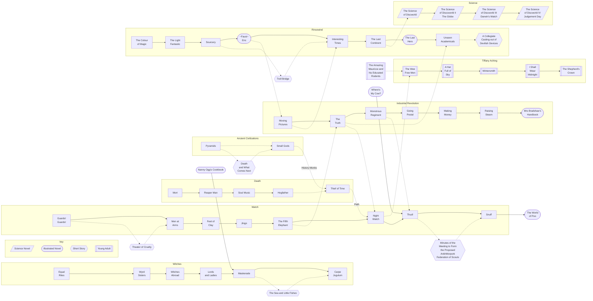

# Discworld

```mermaid
flowchart LR
    subgraph key
    sn[Standard Novel]
    in([Illustrated Novel])
    ss{{Short Story}}
    sn[/Science Novel/]
    ya[[Young Adult]]
    end

    O9([Nanny Ogg's Cookbook])
    O10{{The Sea and Little Fishes}}

    subgraph Witches
        Wt1["`Equal
        Rites`"] -->

        Wt2["`Wyrd
        Sisters`"] -->

        Wt3["`Witches
        Abroad`"] -->

        Wt4["`Lords
        and Ladies`"] -->

        Wt5["`Maskerade`"] -->

        Wt6["`Carpe
        Jugulum`"]
    end

    O9 --> Wt5
    Wt5 -.-> O10
    O10 -.-> Wt6

    subgraph Ancient Civilizations
        AC1[Pyramids] -.->
        AC2[Small Gods]
    end

    subgraph Tiffany Aching
        TA1[["`The Wee
        Free Men`"]] -->

        TA2[["`A Hat
        Full of
        Sky`"]] -->

        TA3[["`Wintersmith`"]] -->

        TA4[["`I Shall
        Wear
        Midnight`"]] -->

        TA5[["`The Shepherd's
        Crown`"]]
    end

    W6 -.-> TA1

    O6{{"`Death
    and What
    Comes Next`"}}

    AC1 -.-> O6 -.-> AC2

    O8[["`The Amazing
    Mauricce and
    his Educated
    Rodents`"]]

    O8 -.-> TA1

    subgraph Death
    direction LR
    D1[Mort] --> D2[Reaper Man] --> D3[Soul Music] --> D4[Hogfather] -.-> D5[Thief of Time]
    end

    AC2 -.History Monks.-> D5

    subgraph Watch
    direction LR
        W1["`Guards!
        Guards!`"] -->

        W2["`Men at
        Arms`"] -->

        W3["`Feet of
        Clay`"] -->

        W4[Jingo] -->

        W5["`The Fifth
        Elephant`"] -->

        W6["`Night
        Watch`"] -->

        W7[Thud!] -->

        W8[Snuff]
    end

    D5 -.Path.-> W6

    subgraph Industrial Revolution
    direction LR
        IR1["`Moving
        Pictures`"] -->

        IR2["`The
        Truth`"] -->

        IR3["`Monstrous
        Regiment`"] -->

        IR4["`Going
        Postal`"] -->

        IR5["`Making
        Money`"] -->

        IR6["`Raising
        Steam`"] -->

        IR7(["`Mrs Bradshaw's
        Handbook`"])
    end

    subgraph Rincewind
    direction LR
        R1["`The Colour
        of Magic`"] -->
        
        R2["`The Light
        Fantastic`"] -->
        
        R3["`Sourcery`"] -->
        
        R4(["`~Faust~
        Eric`"]) -->
        
        R5["`Interesting
        Times`"] -->
        
        R6["`The Last
        Continent`"] -->
        
        R7(["`The Last
        Hero`"]) -->
        
        R8["`Unseen
        Academicals`"] -.->
        
        R9{{"`A Collegiate
        Casting-out of
        Devilish Devices`"}}
    end

    O1{{Troll Bridge}}

    subgraph Science
    direction LR
        S1[/"`The Science 
        of Discworld`"/] -->

        S2[/"`The Science
        of Disccworld II
        The Globe`"/] -->

        S3[/"`The Science
        of Discworld III
        Darwin's Watch`"/] -->
        
        S4[/"`The Science
        of Discworld IV
        Judgement Day`"/]
    end

    R3 -.-> O1 -.-> R5
    R6 -.-> S1

    R4 -.-> IR1 -.-> R5
    IR2 -.-> R8

    O2{{Theater of Cruelty}}

    W1 -.-> O2 -.-> W2
    W5 -.-> IR2 -.-> W6
    IR3 -.-> W7

    O3(["`Where's
    My Cow?`"])

    O4{{"`Minutes of the
    Meeting to Form
    the Proposed
    AnkhMorpork
    Federation of Scouts`"}}

    O5(["`The World
    of Poo`"])
    
    O3 --> W7 -.-> O4 -.-> W8 --> O5


```
