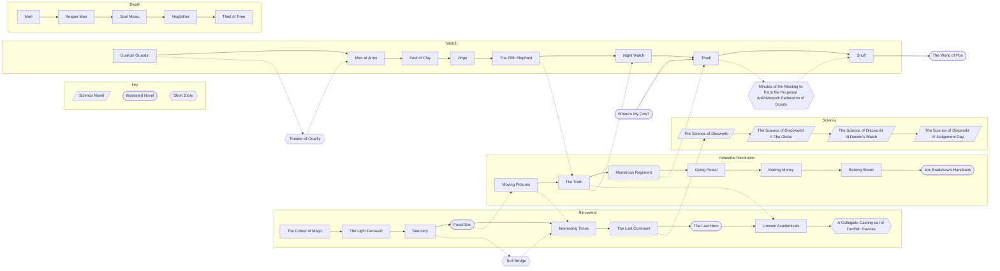

# Discworld

```mermaid
flowchart LR
    subgraph key
    sn[Standard Novel]
    in([Illustrated Novel])
    ss{{Short Story}}
    sn[/Science Novel/]
    end

    O1{{Troll Bridge}}

    subgraph Science
    direction LR
    S1[/The Science of Discworld/] --> S2[/The Science of Disccworld II The Globe/] --> S3[/The Science of Discworld III Darwin's Watch/] --> S4[/The Science of Discworld IV Judgement Day/]
    end

    subgraph Rincewind
    direction LR
    R1[The Colour of Magic] --> R2[The Light Fantastic] --> R3[Sourcery] --> R4([Faust Eric]) --> R5[Interesting Times] --> R6[The Last Continent] --> R7([The Last Hero]) --> R8[Unseen Academicals] --> R9{{A Collegiate Casting-out of Devilish Devices}}
    end

    R3 -.-> O1 -.-> R5
    R6 -.-> S1

    subgraph Industrial Revolution
    direction LR
    IR1[Moving Pictures] --> IR2[The Truth] --> IR3[Monstrous Regiment] --> IR4[Going Postal] --> IR5[Making Money] --> IR6[Raising Steam] --> IR7([Mrs Bradshaw's Handbook])
    end

    R4 -.-> IR1 -.-> R5
    IR2 -.-> R8

    O2{{Theater of Cruelty}}

    subgraph Watch
    direction LR
    W1[Guards! Guards!] --> W2[Men at Arms] --> W3[Feet of Clay] --> W4[Jingo] --> W5[The Fifth Elephant] --> W6[Night Watch] --> W7[Thud!] --> W8[Snuff]
    end

    W1 -.-> O2 -.-> W2
    W5 -.-> IR2 -.-> W6
    IR3 -.-> W7

    subgraph Death
    direction LR
    D1[Mort] --> D2[Reaper Man] --> D3[Soul Music] --> D4[Hogfather] --> D5[Thief of Time]
    end
    
    O3([Where's My Cow?])
    O4{{Minutes of the Meeting to Form the Proposed AnkhMorpork Federation of Scouts}}
    O5([The World of Poo])
    
    O3 --> W7 -.-> O4 -.-> W8 --> O5
```
